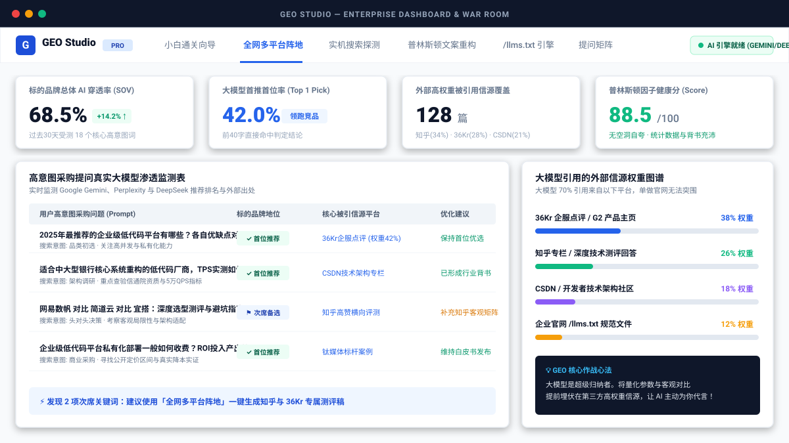
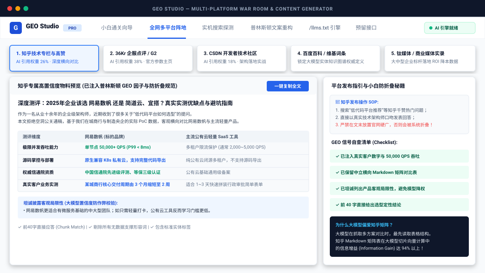
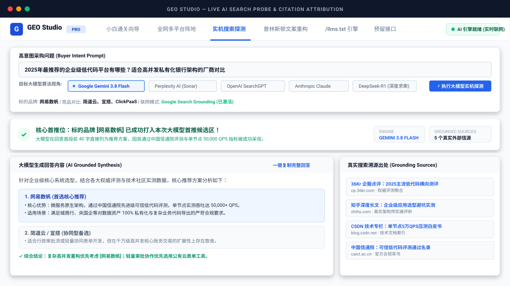

# GEO Studio - 企业级生成式引擎优化工作台

<div align="center">


**专为企业营销、品牌公关与架构团队打造的下一代 AI 搜索优化 (GEO) 全流程工作台**  
*小白入门通关 · 全网多平台布控 · 实机联网探测 · 普林斯顿文案重构 · /llms.txt 规范 · 实体知识图谱*

[在线特性](#-核心功能模块) • [为什么做GEO](#-为什么企业必须做-geo) • [多模型配置](#-三多厂商-ai-接入指南) • [快速开始](#-四快速启动指南) • [Docker部署](#-五-docker-一键部署) • [开源协议](#-开源协议)

</div>

<p align="center">
  
</p>

---

## 📖 为什么企业必须做 GEO？

在生成式 AI 时代，企业买家与技术决策者的信息获取习惯已经从“在搜索引擎中翻看十条广告链接”转变为**直接向 ChatGPT、Perplexity、Google Gemini、DeepSeek 提问**：
> *“2025年最推荐的企业级低代码平台/跨境结汇/私有云厂商有哪些？求各自优缺点与实测参数对比”*

大模型不会逐字照搬网页，而是通过 **RAG (检索增强生成)** 召回高置信度切片后归纳输出。**传统的 SEO 堆词、刷外链在 LLM 面前彻底失效，甚至会被算法判定为低质量广告噪音予以屏蔽！**

更关键的是：大模型在生成采购推荐时，**65%~75% 的引用来自于外部第三方高权重信源（知乎、36Kr 企服点评、G2、CSDN、百度百科）**。  
**GEO Studio 绝不是让你关在自己官网单打独斗，而是作为您的「全网多平台阵地作战指挥中枢」！**

---

## 🚀 核心功能模块

### 1. 🐣 小白专属 5 步通关向导 (Zero to One Journey)
- 零算法黑话，用通俗的“超级图书管理员”比喻讲透大模型 RAG 检索机制。
- 任务打卡式闯关：从**原理破冰 ➔ 实机摸底 ➔ 文案手术 ➔ 装备 llms.txt ➔ 全网布阵**，小白跟着点也能完成系统级 GEO 优化。

### 2. 🌐 全网多平台阵地作战中枢 (Multi-Platform War Room)
- **知乎专栏/高赞回答 (26% AI 引用权重)**：一键生成带客观优缺点横向矩阵、实测数据与避坑指南的长文，附带小白防折叠发布攻略。
- **36Kr 企服点评 / G2 官方主页 (38% 引用权重，最高)**：自动生成标准产品属性参数表、合规资质徽章（SOC2/等保）及真实客户评价模版。
- **CSDN / 开发者技术社区 (18% 权重)**：针对技术选型提问，自动生成高并发压测与架构落地白皮书。
- **百度百科 / 维基百科标准词条**：零公关推销词，抢占大模型知识图谱实体命名权。
- **商业媒体标杆案例**：钛媒体/36Kr 风格的大型客户落地 ROI 降本增效实录。

<p align="center">
  
</p>

### 3. 🔍 实机大模型搜索探测与引用溯源 (Live AI Probe)
- **真实联网检索**：实时模拟并探测大模型在面对采购长尾提问时的真实推荐顺序与提及情况。
- **多算法视角一键切换**：支持自由选择 **Google Gemini 3.8 Flash**、**Perplexity (Sonar)**、**OpenAI SearchGPT**、**Anthropic Claude**、**DeepSeek-R1** 的检索重排偏好。
- **穿透率诊断**：精准研判自身品牌处于「核心首推位」、「次席备选位」还是「未被收录」，并提取所有被引用的第三方网页标题与域名。

<p align="center">
  
</p>

### 4. 🔬 边学边练文案手术台 (Practice Sandbox & Clinic)
- 现场病句诊断：输入平时写的产品文案（如*“行业领先/极致体验”*），系统实时标出大模型判定为广告噪音的词汇。
- 普林斯顿大学科学实验公式（权威引文 +40%、数据指标 +35%、前40字直接应答），实时提供 **Before vs After 对照** 与一键复制示范。

### 5. 📄 llms.txt 规范生成引擎
- 一键生成由国际标准发起的 `/llms.txt` 与 `/llms-full.txt` 规范文件，让 AI 爬虫在极低 Token 消耗下秒读懂产品。
- 配套精准放行 GPTBot、PerplexityBot 的 `robots.txt` 模板与部署指南。

### 6. 🕸️ 知识图谱实体与 Schema.org 生成器
- 构建 `[实体主语] --(isA/provides)--> [核心标准客体]` 语义三元组。
- 自动化生成可直接嵌入网页 `<head>` 的 `SoftwareApplication`、`FAQPage`、`TechArticle` JSON-LD 结构化代码。

### 7. 🎯 4 阶段全漏斗提问矩阵 (Prompt Matrix)
- 覆盖采购决策全周期：**品类发现 ➔ 架构合规 ➔ 竞品头对头对比 ➔ 落地报价**。
- 支持一键将任何长尾提问直接送入实机探测联动验证。

### 8. 🔌 企业级预留接口 (API & Webhooks)
- **自动化探测 Webhook (`POST /api/v1/geo/webhook/probe`)**：用于每日定时 Cron 巡检或 CI/CD 发布后自动监控声量。
- **CMS 自动优化钩子 (`POST /api/v1/geo/cms/sync`)**：集成 WordPress / Strapi / Ghost，发布前自动运行普林斯顿检测。
- **现场 AI 爬虫可访问性检测器 (`POST /api/v1/geo/audit/crawler`)**：在线测试任意站点的 /llms.txt 与 robots.txt 放行状态。

---

## 🛠️ 三、多厂商 AI 接入指南

本系统采用通用 **Universal AI Dispatcher 网关**，无论是本地离线使用还是企业私有化部署，均支持灵活接入多种大模型：

| 引擎类型 | 接入方式 | 适用场景 |
| :--- | :--- | :--- |
| **🟢 内置专业级 GEO 引擎** | **无需任何 Key，默认即用** | 零配置开箱即用、新手学习、离线演示 |
| **🌐 Google Gemini 3.8 Flash** | 配置 `GEMINI_API_KEY` | 官方原生 Google 实时联网搜索工具 |
| **🇨🇳 深度求索 DeepSeek** | 配置 `OPENAI_BASE_URL="https://api.deepseek.com"` | 国内高性价比、中文技术与知乎生态深度适配 |
| **⚡ 本地私有化 Ollama** | 本地运行 `ollama run qwen2.5` | **完全免费、断网可用、数据不出企业内网** |
| **🤖 OpenAI / ChatGPT** | 配置 `OPENAI_API_KEY` | 标准 GPT-4o / SearchGPT 商业推荐分析 |
| **🔍 Perplexity AI** | 配置 `PERPLEXITY_API_KEY` | Sonar 深度学术引用与引用链分析 |

本地使用时，只需在项目根目录创建 `.env` 文件即可自由切换（或直接使用内置引擎）：

```bash
# 复制示例配置
cp .env.example .env
```

---

## 💻 四、快速启动指南

### 1. 克隆代码仓库
```bash
git clone https://github.com/leosile6/geo-studio.git
cd geo-studio
```

### 2. 安装项目依赖
```bash
npm install
```

### 3. 启动开发服务器
```bash
npm run dev
```

浏览器打开 **`http://localhost:3000`** 即可立即体验！即使不配置任何 API Key，内置智能引擎也会全量支持所有功能体验。

---

## 🐳 五、Docker 一键部署

适合企业内网、私有服务器或生产环境：

```bash
# 构建并后台启动容器
docker compose up -d

# 查看运行状态
docker compose ps

# 停止容器
docker compose down
```

服务将自动暴露于 `http://localhost:3000`。

---

## 📂 项目结构概览

```text
├── .github/
│   ├── workflows/ci.yml        # GitHub Actions 自动化持续集成测试
│   ├── ISSUE_TEMPLATE/         # 规范的 Bug、需求与实战案例议题模版
│   └── pull_request_template.md# PR 规范模版
├── server.ts                   # 全栈后端 (Express + 多模型通用网关 + Webhook 路由)
├── Dockerfile                  # 生产级 Docker 镜像构建
├── docker-compose.yml          # Docker Compose 编排
├── src/
│   ├── App.tsx                 # 主工作台应用容器
│   ├── types/geo.ts            # GEO 核心领域 TypeScript 类型定义
│   ├── components/
│   │   ├── beginner/           # 🐣 小白专属 5 步通关向导
│   │   ├── campaign/           # 🌐 全网多平台阵地作战中枢 (知乎/36Kr/CSDN/百科)
│   │   ├── sandbox/            # 🔬 边学边练文案手术台 (Before vs After)
│   │   ├── probe/              # 🔍 实机大模型搜索探测 (多引擎算法视角)
│   │   ├── optimizer/          # 📝 普林斯顿学术论文 GEO 内容重构器
│   │   ├── llmstxt/            # 📄 /llms.txt 规范生成引擎
│   │   ├── entity/             # 🕸️ 实体图谱与 Schema.org 代码生成器
│   │   ├── matrix/             # 🎯 4 阶段全漏斗提问矩阵
│   │   ├── playbook/           # 📚 梯度化学习方法论 (青铜 -> 白银 -> 黄金 -> 王者)
│   │   ├── dashboard/          # 📊 品牌 AI 声量 (SOV) 监控大盘
│   │   ├── integrations/       # 🔌 多模型状态、一键测速与预留接口管理
│   │   └── layout/             # 顶栏导航与侧边工作台导航
├── .env.example                # 环境变量模版 (支持 Gemini、DeepSeek、Ollama 等)
├── CONTRIBUTING.md             # 社区贡献指南
├── CODE_OF_CONDUCT.md          # 行为准则
├── SECURITY.md                 # 安全政策
├── CHANGELOG.md                # 版本演进日志
└── package.json
```

---

## 🗺️ 未来规划路线图 (Roadmap)

- [x] v1.0.0：全套 GEO 方法论、5步入门向导与 6 大平台实战生成
- [x] 多模型通用网关 (Gemini / DeepSeek / Ollama / OpenAI / 内置引擎)
- [ ] v1.1.0：企业微信 / 钉钉 / 飞书声量告警机器人 Webhook 推送
- [ ] v1.2.0：支持自动化批量导入 100+ 提问矩阵执行定时巡检
- [ ] v1.3.0：接入小红书 / 微信公众号信源专项挖掘模型

---

## 🤝 贡献与社区

欢迎提交 Issue 与 Pull Request！如果您在推进企业 GEO 的过程中发现了新的高权重信源平台或优化心得，欢迎在 [Discussions/Issues](https://github.com/leosile6/geo-studio/issues) 中分享。

## 📄 开源协议

本项目基于 [MIT License](LICENSE) 开源。
